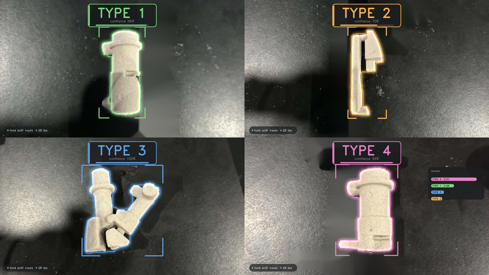
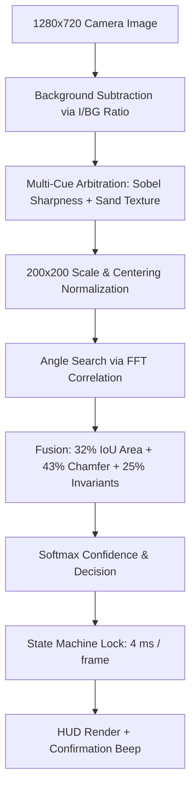

# PartVision — Real-Time Identification of Sand Cores

2D industrial vision system for real-time detection and classification of **sand cores** (4 types).

Works **without GPU**, **without heavy dataset**, and **without neural networks**: a simple USB camera (LifeCam HD-3000), a standard processor (CPU), and deterministic geometric and morphological vision algorithms.



---

## 1. Project Overview

On an assembly or inspection workstation, an operator places a core on the workbench:
1. **Acquisition & Detection:** The camera captures the scene. The system isolates the part from the background even in the presence of strong shadows and specular reflections.
2. **Geometric Identification:** The silhouette is normalized in position and scale. The rotation angle is calculated instantly by FFT correlation, and the part is compared to the references (area overlap + fine Chamfer contour distance).
3. **HUD Display & Sound Signal:** The part type (`TYPE 1`, `TYPE 2`, `TYPE 3`, `TYPE 4`) is displayed largely with a contrasting color code and a confidence gauge. A **beep** sounds as soon as the measurement is stabilized.
4. **CPU Lock:** Once the part is identified, the system locks (4 ms per frame) to save resources and avoid any flickering.

---

## 2. File Structure

The project is streamlined and contains only the files necessary for operation and maintenance:

| File / Directory | Role |
|---|---|
| **`live.py`** | Main application: real-time video stream, background management, classification, and HUD display. |
| **`part_classifier.py`** | Classification engine: signature extraction, FFT alignment, Chamfer distance, Hu moments. |
| **`segmentation.py`** | Image processing engine: robust mask extraction to reflections, adaptive background, and multi-criteria arbitration. |
| **`hud.py`** | OpenCV graphics rendering: type badges, confidence gauge, light halo, and translucent panels. |
| **`enroll.py`** | Learning/enrollment tool: creates or updates `model.npz` (live or via photos). |
| **`check_camera.py`** | Diagnostic tool: detection of the USB camera index and framing adjustment. |
| **`model.npz`** | Compact model containing the signatures of the reference poses (32 poses enrolled for the 4 types). |
| **`model_refs.png`** | Visual control sheet showing the silhouettes registered in `model.npz`. |
| **`refs/`** | Folder containing the actual reference photos and associated background images. |
| **`zone.json`** | *(Auto-generated)* Coordinates of the user-defined work zone. |

---

## 3. How the System Works (Technical Pipeline)



### A. Lighting-Robust Segmentation (`segmentation.py`)
On a reflective table, a warm light reflection has the same beige color and intensity as the sand part. Two mechanisms solve this problem:
* **Adaptive background model by ratio:** The system calculates the ratio $\frac{\text{Image}}{\text{Background}}$ rather than a simple difference. The background auto-refreshes continuously when the scene is empty to absorb slow lighting drifts in the workshop.
* **Physical discriminant criteria:** The reflection is smooth with blurry edges, whereas the part has **very sharp edges** (strong Sobel gradient) and a **rough texture** (local intensity variance $\sigma / \mu$).

### B. Geometric Normalization (`part_classifier.py`)
* The center of gravity (barycenter) is recalculated to recenter the part in the center of a standardized $200 \times 200$ pixel canvas.
* The size is scaled according to $\sqrt{\text{Area}}$, which makes the recognition **invariant to position and camera height variations**.

### C. Rotation Alignment by FFT Correlation
* A radial signature on 256 rays (center-contour distance according to the angle $\theta$) is extracted.
* Rotating the part corresponds to a circular shift of this vector.
* Cross-correlation by **Fast Fourier Transform (`np.fft.rfft`)** gives the exact angle in a tiny computation time ($O(N \log N)$), without iterative angular scanning.

### D. Separating Look-alikes (Type 1 vs Type 4) via Chamfer Distance
Type 1 (cylinder) and Type 4 (cylinder with lug) have almost the same surface area: IoU alone is not enough.
* **Chamfer contour distance (`cv2.distanceTransform`):** Measures the point-to-point distance between the two contours. As soon as a lug is missing or appears, the Chamfer distance immediately penalizes the score.
* **Final weighting:**
  - **$43\,\%$** : Chamfer contour similarity
  - **$32\,\%$** : Area overlap (IoU)
  - **$25\,\%$** : Invariant descriptors (24 Fourier harmonics + 7 Hu moments + 6 geometric ratios)

### E. Optimization by State Locking (4 ms)
* Three-state cycle: `EMPTY` $\rightarrow$ `MEASURE` $\rightarrow$ `LOCKED`.
* As soon as a part is validated, the result is locked. In locked mode, the system stops executing heavy segmentation: it compares a miniature thumbnail ($96 \times 72$ px) of the current scene to the reference one.
* The processing time per frame drops from **500 ms to 4 ms** (125x gain). The processor stays cool and the display is perfectly stable without flickering.

---

## 4. User Guide

### Step 1: Check Camera and Framing
Find your USB camera index (often index `2` for an external LifeCam on Linux):
```bash
python3 check_camera.py
```
Display the video feed to adjust height and focus:
```bash
python3 check_camera.py --show 2
```
*Press `q` to close the preview window.*

---

### Step 2: Launch Live Detection
Start the main program:
```bash
python3 live.py --model model.npz --camera 2
```

#### Keyboard Shortcuts Available During Execution:
| Key | Action |
|:---:|---|
| **`b`** | **Calibrate background** (do this with an empty scene at launch). |
| **`z`** | **Define work zone**: draw a rectangle with the mouse and confirm with `Enter`. Everything outside the zone is ignored. |
| **`c`** | Clear the work zone. |
| **`d`** | Show / hide the **score details** of the 4 types. |
| **`r`** | **Force a new measurement** (unlocks the current decision). |
| **`m`** | Enable / disable the sound beep. |
| **`s`** | Save an instant screenshot. |
| **`+` / `-`** | Adjust the minimum confidence threshold. |
| **`q`** | Quit the application. |

---

### Step 3: Enroll New Parts or New Poses (`enroll.py`)

A 3D part placed on a different face presents a different silhouette. Each stable face can be registered under the same type number.

#### Live with Camera (Recommended):
```bash
python3 enroll.py --live --camera 2 --out model.npz
```
1. Leave the table empty and press **`b`** to calibrate the background.
2. Place the part under the camera.
3. Press the corresponding number (**`1`**, **`2`**, **`3`**, or **`4`**).
4. Turn the part over to another face and press the **same number** again to add this pose.
5. Press **`s`** to save `model.npz`, then **`q`** to quit.
6. Check the generated `model_refs.png` image file to validate the registered silhouettes.

#### From a Folder of Photos:
```bash
python3 enroll.py --images refs/ --out model.npz
```

---

## 5. Industrial Installation Recommendations

To guarantee a maximum recognition rate:

1. **Matte work surface:** Use a **matte** black/grey mat or sheet under the part. This eliminates 90% of specular reflections at the source.
2. **1280×720 Resolution:** The calculation of the granular sand texture is optimal at 720p. Avoid 640×480.
3. **Homogeneous and diffuse lighting:** Prefer a ceiling light or diffuse lighting rather than a direct, low-angle desk lamp that creates hard shadows.
4. **Delimit the work zone (`z`):** If the camera's field of view includes the floor, cables, or the operator's hands, press `z` and draw a frame around the placement area.
5. **Disable auto-exposure (Linux):** To lock the LifeCam sensor settings:
   ```bash
   v4l2-ctl -d /dev/video2 -c exposure_auto=1 -c exposure_absolute=200
   ```

---

## 6. Quick Troubleshooting

* **The part is shown as `UNKNOWN` even though it is well outlined:**
  It is likely a face or orientation that has not yet been enrolled. Enable details with `d` to observe the scores, then add this pose in `enroll.py`.
* **The outline flickers or catches a reflection:**
  Check that the scene is empty and press `b` to recalibrate the background.
* **A part is not detected at all:**
  Make sure it does not touch the edges of the image or the work zone (parts cut by the frame are intentionally ignored to avoid false measurements).

---

## 7. Python Integration (Minimal Example)

To reuse the engine in another Python script:

```python
import cv2
import segmentation as S
from part_classifier import PartClassifier, signature_from_mask

# Load the model
clf = PartClassifier.load("model.npz")

# Load an image and the empty background image
frame = cv2.imread("piece.jpg")
bg = cv2.imread("fond_vide.jpg")

# Contour extraction
mask, cnt = S.segment(frame, background=bg)

if cnt is not None:
    # Classification
    sig = signature_from_mask(mask, cnt)
    res = clf.classify_signature(sig)
    
    print(f"Detected type : {res['label']}")
    print(f"Confidence    : {res['confidence'] * 100:.1f} %")
    print(f"Angle         : {res['angle']:.1f}°")
```
