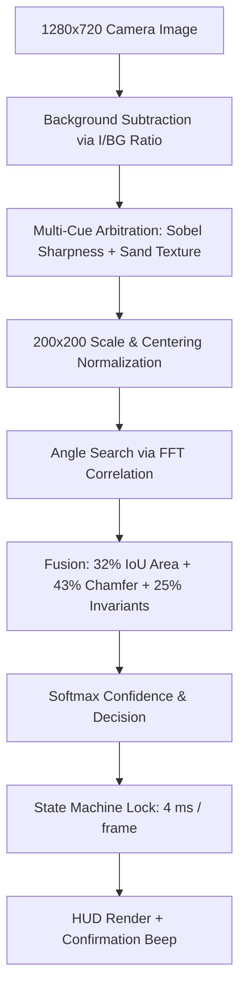

# NRW Makeathon — Autonomous Storage & Retrieval System

End-to-end solution for the NRW Makeathon competition: **real-time vision-based part
identification** feeding a **Gazebo-simulated vertical chain-lift AS/RS storage cell**.

This repository is organised as two independent parts that together form a complete
automated sorting and storage pipeline.

---

## Repository Structure

```
NRW_Makeathon/
├── Part 1 — Computer Vision (this repo root)
│   ├── live.py              Real-time classification pipeline
│   ├── part_classifier.py   Geometric + FFT classification engine
│   ├── segmentation.py      Lighting-robust mask extraction
│   ├── hud.py               OpenCV HUD renderer
│   ├── enroll.py            Part enrollment tool
│   ├── check_camera.py      Camera diagnostics
│   ├── model.npz            Pre-trained model (32 poses, 4 types)
│   ├── model_refs.png       Visual control sheet of enrolled silhouettes
│   └── refs/                Reference photos + background images
│
└── Part 2 — Gazebo Simulation (git submodule → gazebo_nrw)
    └── gazebo_nrw/          Full ROS 2 / Gazebo simulation of the storage cell
```

---

## Part 1 — Computer Vision: PartVision

Real-time detection and classification of **sand cores** (4 types) using a standard
USB camera, **no GPU**, **no neural networks** — pure deterministic geometry and
morphology.

| File | Role |
|---|---|
| **`live.py`** | Main app: video stream, background management, classification, HUD |
| **`part_classifier.py`** | FFT alignment, Chamfer distance, Hu moments |
| **`segmentation.py`** | Lighting-robust mask extraction |
| **`hud.py`** | OpenCV HUD with type badge, confidence gauge, light halo |
| **`enroll.py`** | Creates / updates `model.npz` live or from photos |
| **`check_camera.py`** | USB camera diagnostics |

### Quick Start

```bash
# Check camera index
python3 check_camera.py --show 2

# Calibrate background (press 'b' with empty scene), then place part
python3 live.py --model model.npz --camera 2
```

### Pipeline



---

## Part 2 — Gazebo Simulation: Vertical Chain-Lift AS/RS

Full ROS 2 + Gazebo Harmonic simulation of the vertical chain-lift storage cell that
receives sorted parts from the conveyor and stores them in a paternoster loop.

### The Machine (SolidWorks CAD)


The cell is a 7.7 × 4.6 × 6.2 m structure with:
- A roller in-feed **conveyor** with a sliding carriage and transfer pusher
- A two-tower **chain lift** (paternoster) carrying an extending shelf
- **12 storage slots** on the comptoir, filled by repeated work cycles

### Quick Start

```bash
# Clone with submodule
git clone --recurse-submodules https://github.com/yassinechouk/NRW_Makeathon.git

# Build
cd NRW_Makeathon/gazebo_nrw
./build.sh

# Run the full automatic demo
source install/setup.bash && ros2 launch nrw_sim gazebo.launch.py demo:=true
```

> For full documentation — launch arguments, joint details, the paternoster loop,
> controller switching — see the
> [gazebo_nrw README](https://github.com/yassinechouk/gazebo_nrw).

---

## System Integration

The two parts share a common interface:
- **Part 1** (vision) identifies which of the 4 core types is placed on the workbench
- **Part 2** (simulation) receives sorted parts from the conveyor and stores them in
  the appropriate slot of the paternoster storage cell

In a production setup, the classification result from `live.py` would be published
as a ROS 2 message to route the carriage to the correct storage slot.

---

## Dependencies

### Part 1 — Computer Vision
```bash
pip install opencv-python numpy scipy
```

### Part 2 — Gazebo Simulation
- ROS 2 Jazzy
- Gazebo Harmonic (`gz-sim 8`)
- `gz_ros2_control`, `joint_trajectory_controller`
- `numpy`, `scipy` (mesh rebuild step)
